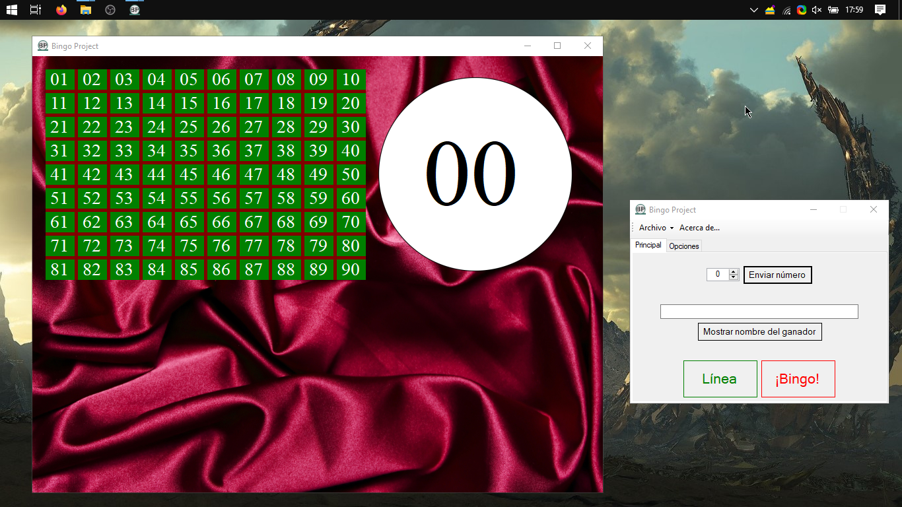
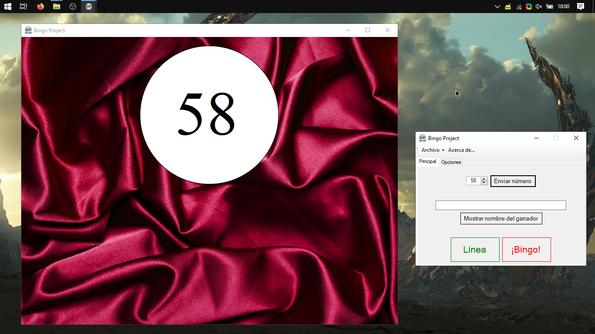
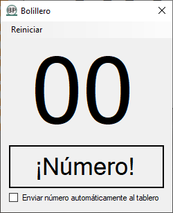
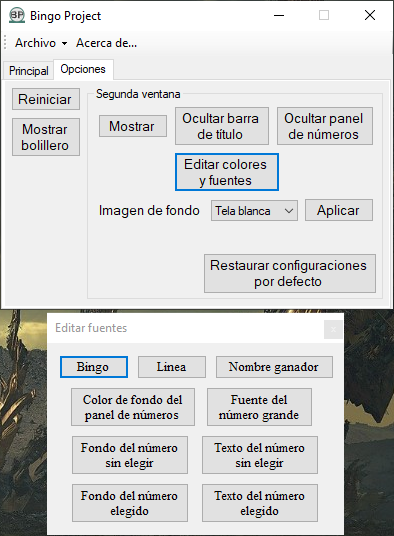
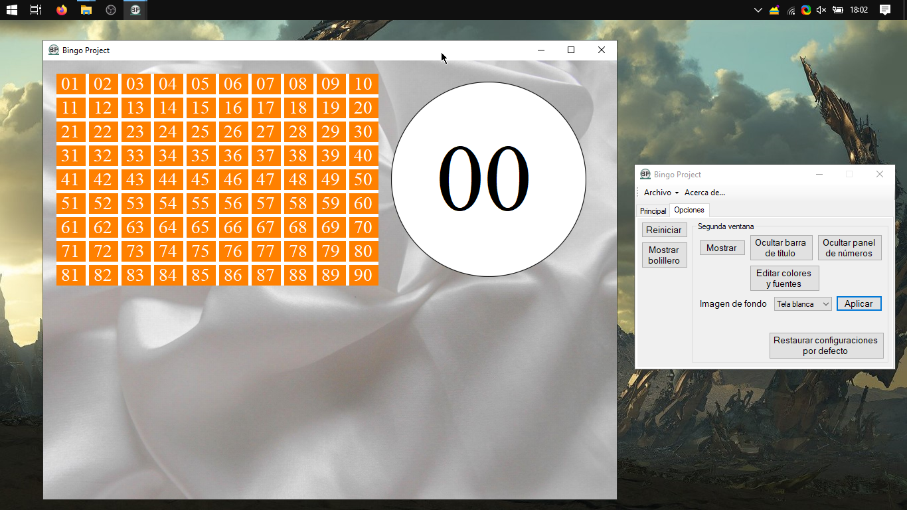
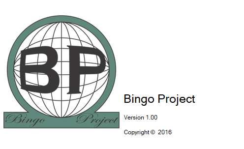

# Bingo Project


This is my very first software project with a real life application!

Before this project all I've developed were (extremely) simple webpages, .NET (using Visual Basic) and BASIC 
applications with no other purpose but joy and learning.

A friend of mine needed a custom Bingo board that he could show through a projector while keeping another
window in his machine for using the software. I knew a little bit of Visual Basic .NET, so I built this 
application for him.

It was largely a success in every possible way. He was pretty satisfied with the end result and I have ended with
a completely new and exciting experience.

Skimming through the code nowadays, I realise how many my English mistakes were back then (notice I changed the 
non-existing word *Proyect* by *Project* somewhere in the middle), how much can actually be done by copying and
pasting lots of code (because, well, that's what I did.) and how much spaghetti code one can create.

This is posted with no prior modification to the original source code I wrote back in 2016 and is meant to be 
kept like that. Original.

> Note: It's written in Spanish. I had plans to continue developement with an English version but I never did it.

## How to clone

Please, please, please, clone this repository inside a folder called `Bingo Proyect`:

```
git clone https://github.com/mzahnd/bingo-project "Bingo Proyect"
```

## Screenshots

Here are some recent screenshots of how the project ended up looking

This is the main window(s). The biggest is supposed to be shown using a projector or another screen while the
other one is "hidden" from the public, visible only to the host.



The board updated whenever the host entered a number. The last number is displayed bigger in a giant "bingo ball"
which changes back to 0 after a couple of seconds.


In case you did not want to show the board the whole time, it can be hidded and only the last number is shown 
(for a few seconds as well). 




If you don't have a cage, don't worrky! There's a random number generator included too! 



And, of course, you could customize it: change the fonts, colors and background as you whish.





I almost forget it! THE SPLASH SCREEN!

No software is a *real software* without one.



## License

> MIT License
>
> Copyright (c) 2021 Martín Zahnd

